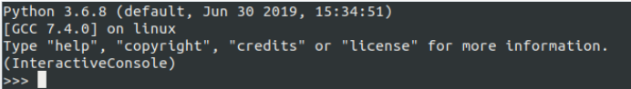

# Взламываем электронный дневник школы
## Fix school еDiary

Взламываем базу данных электронного дневника и улучшаем успеваемость.

Данный скрипт предназначен для исправления плохих оценок (2 и 3), удаления замечаний и добавления поощерений в электронный дневник ученика.

**Внимание!** Скрипт работает, если у пользователя настроен и работает сайт электронного дневника.
Если нет, то можно посмотреть по [ссылке](https://github.com/devmanorg/e-diary/tree/master).

## Как установить
- Нужно скачайть проект.
- Установить зависимости командой `pip install -r requirments.txt`
- Перейти в интерактивный режим командой `python manage.py shell`.
Вы увидите на экране такой режим 
- Имортировать содержимое файла `fix_diary.py`- сначала импорты, потом все функции. Если не знаете как, то просто скопируйте все содержимое файла и вставьте в командную строку после `>>>` и нажмите enter.

## Описание работы функций

### fix_marks
Исправляет все "2" и "3" ученика на "5". Для запуска нужно выполнить команду с указанием имени ученика:

    >>> fix_marks("Фролов Иван")

Если найдено более одного ученика или не найдено ни одного, то скрипт выведет на экран соответствующее сообщение.
Нужно проверить правильность написания и/или ввести полное имя.

### remove_chastisements
Удаляет все замечания. Для запуска нужно выполнить команду с указанием имени ученика:

    >>> remove_chastisements("Фролов Иван")

Если найдено более одного ученика или не найдено ни одного, то скрипт выведет на экран соответствующее сообщение.
Нужно проверить правильность написания и/или ввести полное имя.

### create_commendation
Добавляет похвалу на последнем уроке по выбранному предмету. Для запуска нужно выполнить команду с указанием имени ученика и предмета:

    >>> create_commendation("Фролов Иван", "Музыка")

Скрипт выберет похвалу случайным образом из 15-ти имеющихся вариантов. 
Если найдено более одного ученика или не найдено ни одного, то скрипт выведет на экран соответствующее сообщение.
Нужно проверить правильность написания и/или ввести полное имя.

Если название предмета указано с ошибкой или такого предмета нет, то то скрипт выведет на экран соответствующее сообщение.
Нужно проверить правильность написания названия предмета.   

Проект создан в учебных целях.